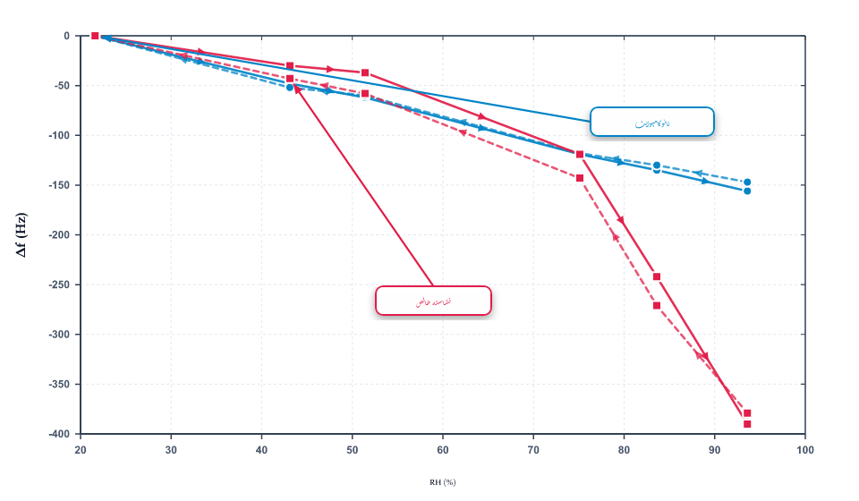

# 🎓 Academic Scatter Plot Generator / رسم‌کننده نمودار آکادمیک

[🇮🇷 برای مطالعه نسخه فارسی کلیک کنید](#-توضیحات-فارسی)

  

A beautiful, interactive, and fully client-side web application designed for students, researchers, and academics to generate **publication-ready scatter plots** with zero coding required.

## ✨ Why this tool?
Often, researchers use complex software (like OriginLab or MATLAB) just to plot simple data or sensor responses. This tool provides a **simple, drag-and-drop web interface** that runs entirely in your browser and exports ultra-HD images ready for journal submission.

## 🚀 Features

- **📊 Dynamic Excel Integration:** Upload your `.xlsx` data directly. The app dynamically detects your columns, assigns distinct colors/markers, and plots them.
- **🔄 Smart Hysteresis Detection:** Automatically detects forward and backward paths in cyclic data (like sensor responses), styling them with directional arrows and dashed return lines.
- **📈 Linear Trendlines & R²:** Automatically calculates the line of best fit and the R² coefficient for regression and scientific analysis.
- **⚡ Custom Axis Limits & Auto-Scaling:** Freely set custom min, max, and step for both axes, or click the Auto Scale button to fit the data bounds using standard academic intervals.
- **📝 Live In-Table Data Editor:** Add, remove, or edit points directly in the interactive data table with full decimal/floating-point support.
- **🖼️ Publication-Quality Export:** 
  - Save as **300/600 DPI PNG** for direct insertion into MS Word or PowerPoint.
  - Save as **Vector SVG** for Adobe Illustrator or Inkscape.
  - One-click **Copy to Clipboard** feature.
- **🖱️ Drag & Drop Callouts:** Click and drag text labels directly on the chart to position them perfectly without overlapping your data.
- **🌍 Bilingual & Dual Theme:** Switch seamlessly between **English (LTR)** and **Persian (RTL)**, and choose between an Academic Light theme or a Modern Dark theme.
- **📁 Included Sample Template:** Try out `Clean_Hysteresis_Data.xlsx` included in the root directory for an instant demonstration of hysteresis loops.

## 🛠️ How to Use

1. Simply download this repository and open `index.html` in any modern web browser. (No server or installation needed!)
2. In the right panel, generate and download an **Excel Template** based on your number of samples (or use `Clean_Hysteresis_Data.xlsx`).
3. Fill the template with your data and upload it back.
4. Customize your titles, markers, colors, and line widths.
5. Export and publish!

---

 

# 🇮🇷 توضیحات فارسی

یک نرم‌افزار تحت وب زیبا، تعاملی و کاملاً آفلاین که برای دانشجویان، محققین و دانشگاهیان طراحی شده تا **نمودارهای پراکندگی (Scatter Plots) در سطح مقالات ISI** را بدون نیاز به هیچ‌گونه برنامه‌نویسی رسم کنند.

## ✨ چرا این ابزار؟
پژوهشگران معمولاً برای رسم یک نمودار ساده یا بررسی رفتار یک سنسور، مجبور به استفاده از نرم‌افزارهای سنگینی مثل OriginLab یا MATLAB می‌شوند. این ابزار یک **رابط کاربری ساده و با قابلیت کشیدن و رها کردن (Drag-and-Drop)** را درون مرورگر شما فراهم می‌کند تا تصاویر Ultra-HD مناسب چاپ در ژورنال‌های علمی را در چند ثانیه خروجی بگیرید.

## 🚀 امکانات اصلی

- **📊 اتصال مستقیم به اکسل:** فایل `.xlsx` خود را مستقیماً در برنامه آپلود کنید. برنامه به‌طور خودکار ستون‌ها را می‌خواند، به هر کدام رنگ و شکل هندسی مجزا اختصاص می‌دهد و نمودار را رسم می‌کند.
- **🔄 تشخیص هوشمند هیسترزیس (رفت و برگشت):** مسیرهای رفت و برگشت در داده‌های دوره‌ای (مثل پاسخ سنسورها) را به صورت هوشمند تشخیص داده و مسیر برگشت را با خط‌چین و فلش‌های جهت‌نما استایل‌دهی می‌کند.
- **📈 رسم خط روند (Trendline) و R²:** محاسبه فرمول خط رگرسیون و ضریب تعیین R² با دقت بالا.
- **⚡ تنظیم دستی و خودکار مقیاس محورها (Auto-Scale):** تعیین Min، Max و Step محورهای X و Y به دلخواه یا با یک کلیک بر روی دکمه تنظیم خودکار مقیاس.
- **📝 جدول داده‌های تعاملی با پشتیبانی اعشار:** امکان ویرایش مستقیم نقاط، افزودن یا حذف سطر درون مرورگر.
- **🖼️ خروجی با کیفیت مقالات (Publication-Quality):**
  - ذخیره تصویر با کیفیت **300 یا 600 DPI (PNG)** برای استفاده مستقیم در MS Word.
  - ذخیره خروجی **وکتور SVG** استاندارد برای ادیت در Adobe Illustrator.
  - کپی مستقیم نمودار در حافظه موقت (Clipboard) با یک کلیک.
- **🖱️ جابجایی لیبل‌ها با موس:** متن‌ها و برچسب‌های روی نمودار را با موس بگیرید و هر کجای نمودار که خواستید قرار دهید.
- **🌍 دو زبانه و دارای دو تم:** پشتیبانی کامل از **فارسی (راست‌چین)** و **انگلیسی (چپ‌چین)** با قابلیت سوئیچ بین تم روشن (دانشگاهی) و تم تیره (مدرن).
- **📁 فایل نمونه آماده:** فایل `Clean_Hysteresis_Data.xlsx` در ریشه پروژه قرار دارد تا بلافاصله بتوانید عملکرد حلقه هیسترزیس را تست کنید.

## 🛠️ راهنمای استفاده

۱. فایل‌های پروژه را دانلود کرده و فایل `index.html` را در مرورگر خود باز کنید (بدون نیاز به اینترنت و نصب!).
۲. از پنل سمت راست، تعداد نمونه‌های خود را مشخص کرده و **قالب خام اکسل** را دانلود کنید.
۳. قالب را با داده‌های خود پر کنید و مجدداً در برنامه آپلود نمایید.
۴. عناوین، رنگ‌ها، ضخامت خطوط و... را شخصی‌سازی کنید.
۵. خروجی بگیرید و در مقاله‌ی خود استفاده کنید!

---
*Open-source and crafted for the academic community.*
